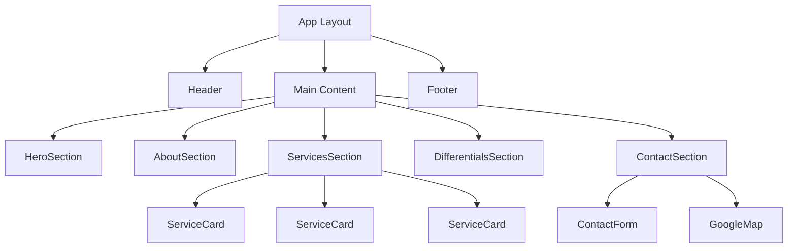
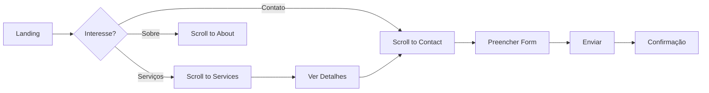
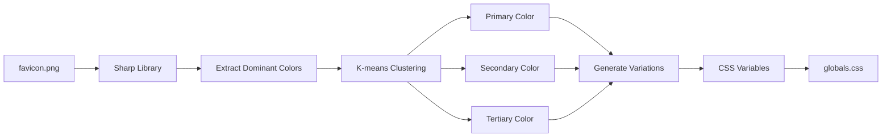

# Design Document - VixSeg Institutional Website

## Overview

O site institucional da VixSeg Tecnologia será desenvolvido como uma Single Page Application (SPA) estática utilizando Next.js 16 com App Router, TailwindCSS v4 e animações interativas do Unicorn.studio. O design seguirá uma abordagem minimalista e moderna, inspirada nos sites de referência (Alarm Center, Grupo SEI, Tattica, Vixseg do Brasil), com foco em transmitir tecnologia, segurança e confiança.

A arquitetura será baseada em componentes React reutilizáveis, com design system consistente extraído das cores do favicon da empresa, garantindo identidade visual coesa em todas as seções.

## Architecture

### Technology Stack

- **Framework**: Next.js 16.0.0 (App Router, Static Export)
- **UI Library**: React 19.2.0 com TypeScript 5
- **Styling**: TailwindCSS v4 com PostCSS
- **Animations**: Unicorn.studio (embedded animations)
- **Forms**: React Hook Form + Zod validation
- **Icons**: Lucide React (minimalista e moderno)
- **Maps**: Google Maps Embed API
- **Image Optimization**: Next.js Image component
- **SEO**: Next.js Metadata API

### Project Structure

```
/app
  layout.tsx          # Root layout com metadata global
  page.tsx            # Home page (todas as seções)
  globals.css         # Tailwind + CSS variables para cores

/components
  /layout
    Header.tsx        # Navegação principal
    Footer.tsx        # Rodapé com links e contatos
  /sections
    HeroSection.tsx   # Hero com animação Unicorn
    AboutSection.tsx  # Sobre Nós
```

    ServicesSection.tsx    # Grid de serviços
    DifferentialsSection.tsx # Diferenciais
    ContactSection.tsx     # Formulário e mapa

/ui
Button.tsx # Botão CTA reutilizável
Card.tsx # Card de serviço
Input.tsx # Input de formulário
Textarea.tsx # Textarea de formulário
WhatsAppButton.tsx # Botão flutuante do WhatsApp

/lib
colors.ts # Extração de cores do favicon
animations.ts # Configurações Unicorn.studio
validations.ts # Schemas Zod

/public
/images
hero-video.mp4 # Vídeo da Grande Vitória
hero-fallback.jpg # Fallback para vídeo
favicon.ico # Gerado do favicon.png

````

### Rendering Strategy

- **Static Site Generation (SSG)**: Site completamente estático exportado
- **No Server-Side Rendering**: Não requer servidor Node.js
- **Client-Side Animations**: Unicorn.studio carregado dinamicamente
- **Progressive Enhancement**: Funcional sem JavaScript, melhorado com JS

## Components and Interfaces

### 1. Layout Components

#### Header Component
```typescript
interface HeaderProps {
  transparent?:lean; // Para hero section
}
````

**Funcionalidades**:

- Logo da VixSeg (SVG otimizado)
- Navegação com âncoras suaves: Home, Sobre, Serviços, Diferenciais, Contato
- Menu hamburguer responsivo para mobile
- Sticky header com background blur ao scroll
- Animação de entrada fade-down

#### Footer Component

```typescript
interface FooterProps {
  className?: string;
}
```

**Estrutura**:

- 3 colunas em desktop, stack em mobile
- Coluna 1: Logo + descrição curta
- Coluna 2: Links rápidos
- Coluna 3: Contato + redes sociais
- Copyright bar no bottom

### 2. Section Components

#### HeroSection Component

```typescript
interface HeroSectionProps {
  videoSrc: string;
  fallbackImage: string;
}
```

**Design**:

- Full viewport height (100vh)
- Vídeo background com overlay escuro (opacity 0.6)
- Conteúdo centralizado verticalmente
- Headline: Poppins Bold 3.5rem (desktop) / 2rem (mobile)
- Subheadline: Inter Regular 1.25rem
- CTA Button com animação de pulso do Unicorn.studio
- Scroll indicator animado no bottom

**Unicorn.studio Animation**:

- Elemento: Partículas flutuantes de segurança (cadeados, escudos)
- Comportamento: Movimento parallax suave ao scroll
- Performance: Lazy load após First Contentful Paint

#### AboutSection Component

```typescript
interface AboutSectionProps {
  title: string;
  description: string;
  location: LocationInfo;
  contacts: ContactInfo;
}
```

**Layout**:

- Container max-width 1200px
- Grid 2 colunas: Texto (60%) + Info Box (40%)
- Info Box com background gradient e border radius
- Ícones de localização e telefone
- Animação fade-up ao entrar no viewport

#### ServicesSection Component

```typescript
interface Service {
  id: string;
  title: string;
  description: string;
  icon: LucideIcon;
}

interface ServicesSectionProps {
  services: Service[];
}
```

**Grid Layout**:

- Desktop: 3 colunas
- Tablet: 2 colunas
- Mobile: 1 coluna
- Gap: 2rem

**Service Card Design**:

- Background: white com border sutil
- Padding: 2rem
- Border radius: 1rem
- Hover: Elevação (shadow-xl) + brilho sutil
- Ícone: 3rem, cor primária
- Título: Poppins SemiBold 1.5rem
- Descrição: Inter Regular 1rem

**Unicorn.studio Animation**:

- Hover effect: Glow pulsante ao redor do card
- Icon animation: Rotação suave 360° em 0.6s

#### DifferentialsSection Component

```typescript
interface Differential {
  id: string;
  title: string;
  icon: LucideIcon;
}

interface DifferentialsSectionProps {
  differentials: Differential[];
}
```

**Layout**:

- Background com gradient sutil
- Grid 5 colunas (desktop) / 2 colunas (tablet) / 1 coluna (mobile)
- Ícones grandes centralizados
- Texto abaixo do ícone

**Unicorn.studio Animation**:

- Entrada: Slide-in sequencial com delay escalonado
- Ícones: Bounce suave ao aparecer

#### ContactSection Component

```typescript
interface ContactFormData {
  name: string;
  email: string;
  phone: string;
  message: string;
}

interface ContactSectionProps {
  onSubmit: (data: ContactFormData) => Promise<void>;
}
```

**Layout**:

- Grid 2 colunas: Formulário (50%) + Mapa (50%)
- Mobile: Stack vertical

**Form Design**:

- Inputs com border focus animado
- Labels flutuantes
- Validação em tempo real
- Mensagens de erro abaixo dos campos
- Submit button com loading state

**Unicorn.studio Animation**:

- Button: Pulso suave contínuo
- Submit: Ripple effect ao clicar

### 3. UI Components

#### Button Component

```typescript
interface ButtonProps {
  variant: "primary" | "secondary" | "outline";
  size: "sm" | "md" | "lg";
  loading?: boolean;
  children: React.ReactNode;
  onClick?: () => void;
}
```

**Variants**:

- Primary: Background cor primária, texto branco
- Secondary: Background cor secundária, texto branco
- Outline: Border cor primária, texto cor primária

**States**:

- Hover: Escurecimento 10%
- Active: Scale 0.98
- Disabled: Opacity 0.5
- Loading: Spinner animado

#### WhatsAppButton Component

```typescript
interface WhatsAppButtonProps {
  phoneNumber: string;
  message?: string;
  className?: string;
}
```

**Design**:

- Posição: Fixed bottom-right (20px do canto)
- Tamanho: 60x60px (mobile) / 70x70px (desktop)
- Background: Verde WhatsApp (#25D366)
- Ícone: Logo WhatsApp branco centralizado
- Shadow: Elevação pronunciada (shadow-2xl)
- Z-index: 9999 para ficar acima de tudo

**Behavior**:

- Click: Abre WhatsApp Web (desktop) ou app (mobile)
- URL: `https://wa.me/5527999739028?text=Olá!%20Gostaria%20de%20solicitar%20um%20orçamento.`
- Hover: Scale 1.1 + shadow aumentada
- Animation: Pulso suave contínuo para chamar atenção

**Accessibility**:

- ARIA label: "Falar no WhatsApp"
- Keyboard accessible
- Focus indicator visível

## Data Models

### Color System

```typescript
interface ColorPalette {
  primary: {
    main: string; // Verde tecnológico do favicon
    light: string; // +20% lightness
    dark: string; // -20% lightness
  };
  secondary: {
    main: string; // Azul escuro corporativo
    light: string;
    dark: string;
  };
  tertiary: {
    main: string; // Cinza metálico
    light: string;
    dark: string;
  };
  neutral: {
    white: string;
    gray: string[]; // 9 tons de cinza
    black: string;
  };
}
```

**Extração de Cores**:

- Utilizar biblioteca `sharp` para processar favicon.png
- Extrair cores dominantes com algoritmo k-means
- Gerar variações light/dark com HSL manipulation
- Exportar como CSS variables em globals.css

### Typography System

```typescript
interface TypographyScale {
  fontFamily: {
    heading: string; // 'Poppins', sans-serif
    body: string; // 'Inter', sans-serif
  };
  fontSize: {
    xs: string; // 0.75rem
    sm: string; // 0.875rem
    base: string; // 1rem
    lg: string; // 1.125rem
    xl: string; // 1.25rem
    "2xl": string; // 1.5rem
    "3xl": string; // 1.875rem
    "4xl": string; // 2.25rem
    "5xl": string; // 3rem
    "6xl": string; // 3.75rem
  };
  fontWeight: {
    light: number; // 300
    regular: number; // 400
    medium: number; // 500
    semibold: number; // 600
    bold: number; // 700
  };
  lineHeight: {
    tight: number; // 1.25
    normal: number; // 1.5
    relaxed: number; // 1.75
  };
}
```

### Service Data Model

```typescript
interface ServiceData {
  services: Array<{
    id: string;
    slug: string;
    title: string;
    shortDescription: string;
    icon: string;
    order: number;
  }>;
}
```

**Services Content**:

1. Sistema de CFTV - "Monitoramento em tempo real com câmeras de alta resolução"
2. Alarme Residencial e Empresarial - "Proteção inteligente com sensores modernos"
3. Cerca Elétrica - "Barreiras físicas e eletrônicas de alta eficiência"
4. Controle de Acesso - "Gestão automatizada de entradas e saídas"
5. Interfones e Videoporteiros - "Comunicação prática e segura"
6. Manutenção Preventiva e Corretiva - "Garantia de funcionamento contínuo"

### Company Data Model

```typescript
interface CompanyData {
  name: string;
  slogan: string;
  description: string;
  address: {
    street: string;
    number: string;
    complement: string;
    neighborhood: string;
    city: string;
    state: string;
    zipCode: string;
    coordinates: {
      lat: number;
      lng: number;
    };
  };
  contacts: {
    phone: string;
    emergency: string;
    email: string;
  };
  social: {
    facebook?: string;
    instagram?: string;
    linkedin?: string;
  };
  differentials: string[];
}
```

## Error Handling

### Form Validation

- **Client-side**: Zod schemas com mensagens em português
- **Required fields**: Nome, Email, Telefone, Mensagem
- **Email validation**: Regex pattern RFC 5322
- **Phone validation**: Formato brasileiro (XX) XXXXX-XXXX
- **Error display**: Mensagens abaixo dos campos com ícone de alerta

### Image Loading

- **Fallback images**: Placeholder blur durante carregamento
- **Error state**: Imagem genérica se falhar o load
- **Lazy loading**: Intersection Observer para imagens below fold

### Animation Failures

- **Graceful degradation**: Site funcional sem Unicorn.studio
- **Timeout**: 5s para carregar scripts de animação
- **Fallback**: CSS animations nativas se Unicorn falhar

### Network Errors

- **Form submission**: Retry logic com exponential backoff
- **User feedback**: Toast notifications para sucesso/erro
- **Offline detection**: Mensagem informativa se sem conexão

## Testing Strategy

### Unit Tests

- **Components**: Renderização e props
- **Utilities**: Funções de validação e formatação
- **Color extraction**: Verificar output correto do favicon

### Integration Tests

- **Form flow**: Preenchimento e submissão
- **Navigation**: Scroll suave para âncoras
- **Responsive**: Breakpoints e layout adaptativo

### E2E Tests (Optional)

- **User journey**: Navegação completa do site
- **Form submission**: Fluxo end-to-end de contato
- **Cross-browser**: Chrome, Firefox, Safari

### Performance Tests

- **Lighthouse**: Score mínimo 90 em todas as métricas
- **Core Web Vitals**:
  - LCP < 2.5s
  - FID < 100ms
  - CLS < 0.1
- **Bundle size**: JavaScript < 200KB gzipped

### Accessibility Tests

- **WCAG 2.1 Level AA**: Conformidade completa
- **Keyboard navigation**: Todos os elementos acessíveis
- **Screen readers**: ARIA labels apropriados
- **Color contrast**: Mínimo 4.5:1 para texto normal

## Visual Design References

### Inspiration Analysis

**Alarm Center** (alarmcenter.com.br):

- Hero com vídeo background
- Cards de serviços com hover effects
- Cores escuras com acentos em azul

**Grupo SEI** (gruposei.com.br):

- Layout limpo e espaçado
- Tipografia bold para títulos
- Seção de diferenciais com ícones

**Tattica** (grupotattica.com.br):

- Design minimalista
- Animações sutis ao scroll
- Grid de serviços bem organizado

**Vixseg do Brasil** (vixseg.com.br):

- Identidade visual verde/azul
- Informações de contato destacadas
- Seção sobre com foto da equipe

### Design Decisions

1. **Color Scheme**: Extrair do favicon para manter identidade existente
2. **Typography**: Poppins para modernidade, Inter para legibilidade
3. **Spacing**: Sistema 8px base para consistência
4. **Animations**: Sutis e performáticas, não distrativas
5. **Images**: Alta qualidade, otimizadas, com lazy loading
6. **CTAs**: Destaque visual com cor primária e animações
7. **Mobile**: Prioridade absoluta, touch-friendly
8. **Loading**: Skeleton screens para melhor UX

## SEO Strategy

### On-Page SEO

- **Title**: "VixSeg Tecnologia | Segurança Eletrônica em Serra ES"
- **Description**: "Instalação e manutenção de sistemas de segurança eletrônica. CFTV, alarmes, cercas elétricas. +10 anos de experiência. Atendimento 24h."
- **Keywords**: segurança eletrônica serra es, cftv vitória, alarme residencial, cerca elétrica
- **Headings**: Hierarquia H1 > H2 > H3 correta
- **Alt texts**: Descritivos para todas as imagens
- **Structured data**: LocalBusiness schema.org

### Technical SEO

- **Sitemap**: Gerado automaticamente
- **Robots.txt**: Permitir crawling de todas as páginas
- **Canonical URLs**: Definidos para evitar duplicação
- **Mobile-friendly**: Teste do Google aprovado
- **Page speed**: Otimizado para carregamento rápido
- **HTTPS**: Certificado SSL obrigatório

### Local SEO

- **Google My Business**: Integração com perfil da empresa
- **NAP consistency**: Nome, endereço, telefone consistentes
- **Local keywords**: Serra ES, Grande Vitória, Espírito Santo
- **Maps integration**: Google Maps embed com localização exata

## Accessibility Considerations

- **Semantic HTML**: Tags apropriadas para estrutura
- **ARIA labels**: Para elementos interativos
- **Focus indicators**: Visíveis em navegação por teclado
- **Color contrast**: WCAG AA compliant
- **Font sizes**: Mínimo 16px para body text
- **Touch targets**: Mínimo 44x44px
- **Alt texts**: Descritivos e concisos
- **Form labels**: Associados corretamente aos inputs
- **Skip links**: Para navegação rápida
- **Reduced motion**: Respeitar prefers-reduced-motion

## Performance Optimization

### Image Optimization

- **Format**: WebP com fallback JPEG
- **Sizing**: Responsive images com srcset
- **Compression**: Quality 80-85%
- **Lazy loading**: Below fold images
- **Blur placeholder**: Durante carregamento

### Code Splitting

- **Route-based**: Automático pelo Next.js
- **Component-based**: Dynamic imports para componentes pesados
- **Vendor splitting**: Bibliotecas separadas do app code

### Caching Strategy

- **Static assets**: Cache-Control: public, max-age=31536000
- **HTML**: Cache-Control: public, max-age=3600
- **API responses**: Não aplicável (site estático)

### Bundle Optimization

- **Tree shaking**: Remover código não utilizado
- **Minification**: Terser para JS, cssnano para CSS
- **Compression**: Gzip/Brotli no servidor
- **Critical CSS**: Inline para above-the-fold

## Deployment Strategy

### Build Process

1. Extract colors from favicon.png
2. Generate CSS variables
3. Build Next.js static export
4. Optimize images
5. Generate sitemap
6. Run Lighthouse audit

### Hosting Options

- **Vercel**: Recomendado (integração nativa Next.js)
- **Netlify**: Alternativa com bom CDN
- **GitHub Pages**: Opção gratuita
- **AWS S3 + CloudFront**: Escalável e performático

### CI/CD Pipeline

- **Trigger**: Push to main branch
- **Steps**: Install → Lint → Build → Test → Deploy
- **Rollback**: Automático se build falhar
- **Preview**: Deploy de preview para PRs

## Future Enhancements

### Phase 2 (Optional)

- Blog para conteúdo sobre segurança
- Galeria de projetos realizados
- Depoimentos de clientes
- Chat online para atendimento
- Calculadora de orçamento interativa
- Área do cliente (login)
- Integração com CRM

### Analytics

- **Google Analytics 4**: Tracking de eventos
- **Hotjar**: Heatmaps e session recordings
- **Search Console**: Monitoramento de SEO
- **PageSpeed Insights**: Performance contínua

## Mermaid Diagrams

### Component Hierarchy



### User Flow



### Color Extraction Flow



## Conclusion

Este design document estabelece uma base sólida para o desenvolvimento do site institucional da VixSeg Tecnologia. A arquitetura modular, componentes reutilizáveis e design system consistente garantirão um site moderno, performático e fácil de manter. As animações do Unicorn.studio adicionarão dinamismo sem comprometer a performance, e a abordagem mobile-first garantirá excelente experiência em todos os dispositivos.
